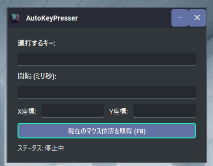

<p align="center">

<br>
<h1 align="center">AutoKeyPresser</h1>
<h2 align="center">

[](https://github.com/Sunwood-ai-labs/AutoKeyPresser)
[](https://github.com/Sunwood-ai-labs/AutoKeyPresser)
[](https://github.com/Sunwood-ai-labs/AutoKeyPresser)
[](https://github.com/Sunwood-ai-labs/AutoKeyPresser)
[](https://github.com/Sunwood-ai-labs/AutoKeyPresser)
[](https://github.com/Sunwood-ai-labs/AutoKeyPresser)
[](https://github.com/Sunwood-ai-labs/AutoKeyPresser)

  <br>

</h2>

自動でキー入力やマウスクリックを行うWindows用アプリケーションです。スタイリッシュなタイトルバーを持ち、指定したキーや座標を指定した間隔で連打することができます。

</p>

## 特徴



- **キー連打機能**: 指定したキーを指定した間隔で自動的に連打します。
- **マウスクリック機能**: 指定した座標を指定した間隔で自動的にクリックします。
- **同時実行**: キー連打とマウスクリックを同時に行うことが可能です。
- **カスタムタイトルバー**: おしゃれなタイトルバーで、ウィンドウのドラッグやサイズ変更が可能です。
- **ホットキー対応**:
  - **F8**: 現在のマウス座標を取得
  - **F9**: 連打開始
  - **F10**: 連打停止

## 必要な環境

- Windows OS
- Python 3.x

## インストール

### 1. リポジトリのクローン

```bash
git clone https://github.com/yourusername/auto-clicker.git
cd auto-clicker
```

### 2. 仮想環境の作成とアクティブ化

#### コマンドプロンプトの場合:

```bash
python -m venv venv
venv\Scripts\activate
```

#### PowerShellの場合:

```bash
python -m venv venv
.\venv\Scripts\Activate.ps1
```

*注: 実行ポリシーのエラーが出た場合は、以下を実行してください。*

```bash
Set-ExecutionPolicy -ExecutionPolicy RemoteSigned -Scope CurrentUser
.\venv\Scripts\Activate.ps1
```

### 3. 必要なライブラリのインストール

```bash
uv pip install -r requirements.txt
```

*`requirements.txt` の内容:*

```
PyQt6
pyautogui
qt_material
keyboard
Pillow
```

## 使い方

### 1. アプリケーションの起動

```bash
python auto_clicker.py
```

### 2. キーの指定

- **連打するキー**: 連打したいキーを入力します。
  - 通常のキー: `a`, `b`, `1`, `2` など
  - 特殊キー: `enter`, `space`, `tab` など

### 3. 間隔の指定

- **間隔 (ミリ秒)**: キーやクリックを連打する間隔をミリ秒単位で入力します。

### 4. 座標の指定

- **X座標**と**Y座標**: 連打したいマウスの位置を入力します。
- **現在のマウス位置を取得 (F8)** ボタンをクリックするか、**F8キー**を押すと、現在のマウス座標が自動的に入力されます。

### 5. 連打の開始と停止

- **開始**: **F9キー**を押します。
- **停止**: **F10キー**を押します。

### 6. ステータスの確認

- アプリケーションウィンドウ内のステータスラベルで、現在の状態（実行中または停止中）を確認できます。

## 注意事項

- **管理者権限の必要性**: アプリケーションはキーボードとマウスの操作を制御するため、管理者権限での実行が必要な場合があります。コマンドプロンプトやPowerShellを管理者として実行してください。
  
- **アンチウイルスソフトとの干渉**: 一部のアンチウイルスソフトウェアやセキュリティソフトウェアは、キーボードやマウスの自動操作をブロックすることがあります。その場合、アプリケーションを許可リストに追加してください。

- **デュアルモニター環境での座標取得**: 複数のモニターを使用している場合、座標が想定と異なる場合があります。必要に応じて座標を調整してください。

- **自己責任**: 本アプリケーションの使用により生じたいかなる損害や問題に対しても、開発者は一切の責任を負いません。自己責任でご使用ください。

## カスタマイズ

### カラーテーマの変更

`auto_clicker.py` 内の以下の行を編集することで、テーマを変更できます。

```python
apply_stylesheet(app, theme='dark_teal.xml')
```

利用可能なテーマは、`qt_material` のドキュメントを参照してください。

### アイコンの変更

`icon.png` をお好きなアイコン画像に差し替えてください。コード内のアイコンパスも必要に応じて変更してください。

```python
self.icon_label.setPixmap(QIcon("icon.png").pixmap(20, 20))
```

## ライセンス

このプロジェクトはMITライセンスの下で提供されています。

## 貢献

バグ報告や機能改善の提案は、IssueやPull Requestを通じてお知らせください。

## 作者

- **お名前**: Your Name
- **メール**: your.email@example.com

## 謝辞

- [PyQt6](https://www.riverbankcomputing.com/software/pyqt/)
- [PyAutoGUI](https://pyautogui.readthedocs.io/en/latest/)
- [qt_material](https://github.com/UN-GCPDS/qt-material)
- [keyboard](https://github.com/boppreh/keyboard)

## トラブルシューティング

### Q1: キー入力やマウスクリックが機能しません。

- **A**: 管理者権限でアプリケーションを実行してください。また、アンチウイルスソフトがブロックしていないか確認してください。

### Q2: ホットキーが反応しません。

- **A**: 他のアプリケーションで同じホットキーが使用されている可能性があります。可能であれば、そのアプリケーションを終了するか、ホットキーを変更してください。

### Q3: エラーメッセージが表示されてアプリケーションが起動しません。

- **A**: 必要なライブラリが正しくインストールされているか確認してください。仮想環境がアクティブになっているかもご確認ください。

## 更新情報

- **バージョン 1.0** (2023-10-01)
  - 初回リリース

---

ご不明な点や問題がありましたら、お気軽にお問い合わせください。
